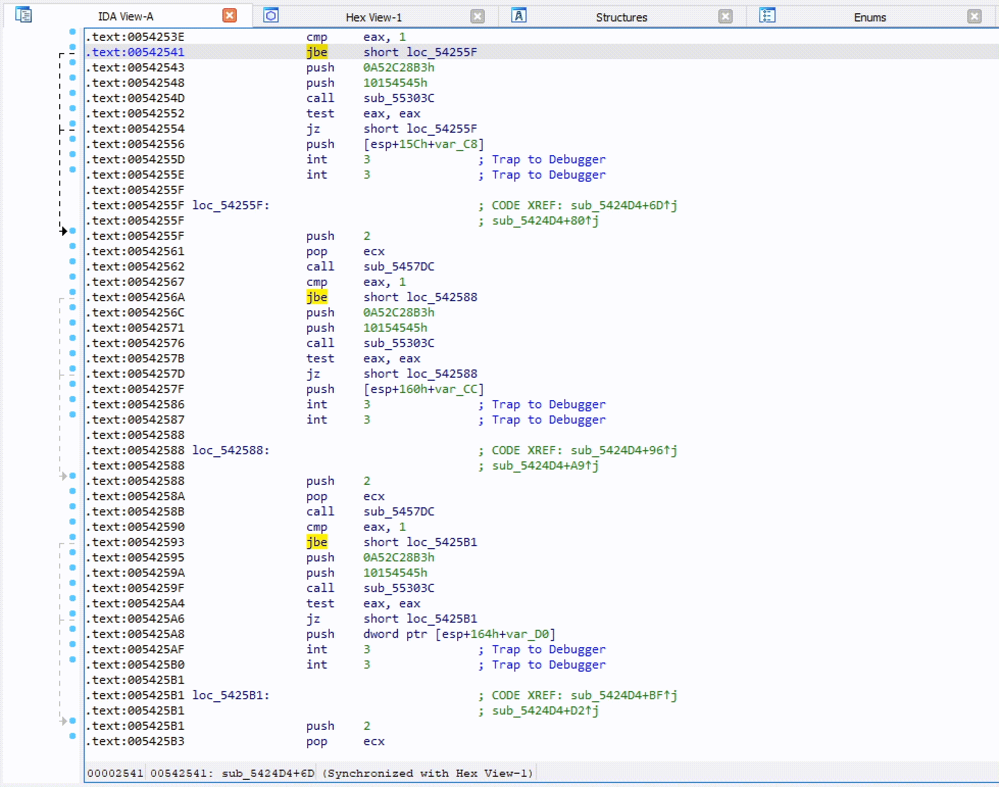

# Local HashDB implementation
This is a local implementation of [HashDB by OALabs](https://hashdb.openanalysis.net/). It consists of three parts:

1. The [IDA-Plugin](hashdb.py) (see below)
2. The [HashDB-Builder](./hashdb_builder/) to build a local database that can be used as replacement to the HashDB-Lookup-Service
3. A [hook](./hashdb_hook/) to run requests on the local DB

## Quickstart
1. Download the latest release and unzip it in your IDA plugins directory - `%PROGRAMFILES%/IDA/plugins/` usually (contains a prebuilt lookup database, have a look at [HashDB builder](./hashdb_builder/README.md) on how to build your own)
2. Create the directory `%LOCALAPPDATA%/hashdb/`
3. Move the file `hashdb.sqlite3` to the location `%LOCALAPPDATA%/hashdb/`
4. Done

# HashDB IDA Plugin (based on [OALabs Plugin](https://github.com/OALabs/hashdb-ida))
Malware string hash lookup plugin for IDA Pro. This plugin uses the [hook](./hashdb_hook/) to query the local database instead of the online HashDB service.

## Preparing the plugin for local usage
The default API URL for the HashDB Lookup Service is `https://hashdb.openanalysis.net/`. To use the local [HashDB implementation](./hashdb_builder/) you first have to patch the plugin file using the [local.patch](./local.patch) file running the command `patch hashdb.py local.patch`.

## Showcase

    

## Using HashDB
HashDB can be used to look up strings that have been hashed in malware by right-clicking on the hash constant in the IDA disassembly view and launching the `HashDB Lookup` client. 

### Settings
Before the plugin can be used to look up hashes the HashDB settings must be configured. The settings window can be launched from the plugins menu `Edit->Plugins->HashDB`.

    

#### Hash Algorithms
Click `Refresh Algorithms` to pull a list of supported hash algorithms from the HashDB API, then select the algorithm used in the malware you are analyzing. 

#### Optional XOR
There is also an option to enable XOR with each hash value as this is a common technique used by malware authors to further obfuscate hashes.

#### Enum Name
When a new hash is identified by HashDB the hash and its associated string are added to an **enum** in IDA. This enum can then be used to convert hash constants in IDA to their corresponding enum name. The enum name is configurable from the settings in the event that there is a conflict with an existing enum.

### Hash Lookup
Once the plugin settings have been configured you can right-click on any constant in the IDA disassembly window and look up the constant as a hash. The right-click also provides a quick way to set the XOR value if needed.

    

### Bulk Import
If a hash is part of a module a prompt will ask if you want to import all the hashes from that module. This is a quick way to pull hashes in bulk. For example, if one of the hashes identified is `Sleep` from the `kernel32` module, HashDB can then pull all the hashed exports from `kernel32`.

    

### Algorithm Search
HashDB also includes a basic algorithm search that will attempt to identify the hash algorithm based on a hash value. **The search will return all algorithms that contain the hash value, it is up to the analyst to decide which (if any) algorithm is correct.** To use this functionality right-click on the hash constant and select `HashDB Hunt Algorithm`.

    

All algorithms that contain this hash will be displayed in a chooser box. The chooser box can be used to directly select the algorithm for HashDB to use. If `Cancel` is selected no algorithm will be selected.

    

### Dynamic Import Address Table Hash Scanning
Instead of resolving API hashes individually (inline in code) some malware developers will create a block of import hashes in memory. These hashes are then all resolved within a single function creating a dynamic import address table which is later referenced in the code. In these scenarios the **HashDB Scan IAT** function can be used.

    

Simply select the import hash block, right-click and choose `HashDB Scan IAT`. HashDB will attempt to resolve each individual integer type (`DWORD/QWORD`) in the selected range.

# [Standing on the shoulders of those that stand on the shoulders of giants](https://github.com/OALabs/hashdb?tab=readme-ov-file#standing-on-the-shoulders-of-giants)
This project relies strongly on the work of [OALabs](https://www.openanalysis.net/) and their implementation of [HashDB](https://github.com/OALabs/hashdb). Therefore, kudos to the folks over there for creating such an awesome tool that makes the analysis of samples using any sort of hashing so much more enjoyable.

# Credits

The following people authored the database building/lookup logic, function database creation and some of the algorithms:
* [Tatjana Ljucovic](https://github.com/ljucovic)
* [Melissa Eckardt](https://github.com/meck-gd)
* [Luca Ebach](https://github.com/lucebac)
* [Hannes](https://github.com/laeberkaes)

# Licensing
This repository contains code and content that are covered under different licenses. Please note the assignment of licenses to specific areas:

Under [Apache 2.0 License](./LICENSE-APACHE2.0):
/hashdb_builder/algorithms/*
/hashdb_builder/tests/*

Other files or resources in the repository that are not explicitly assigned to a specific license fall under the [BSD 3-Clause License](./LICENSE-BSD3).
