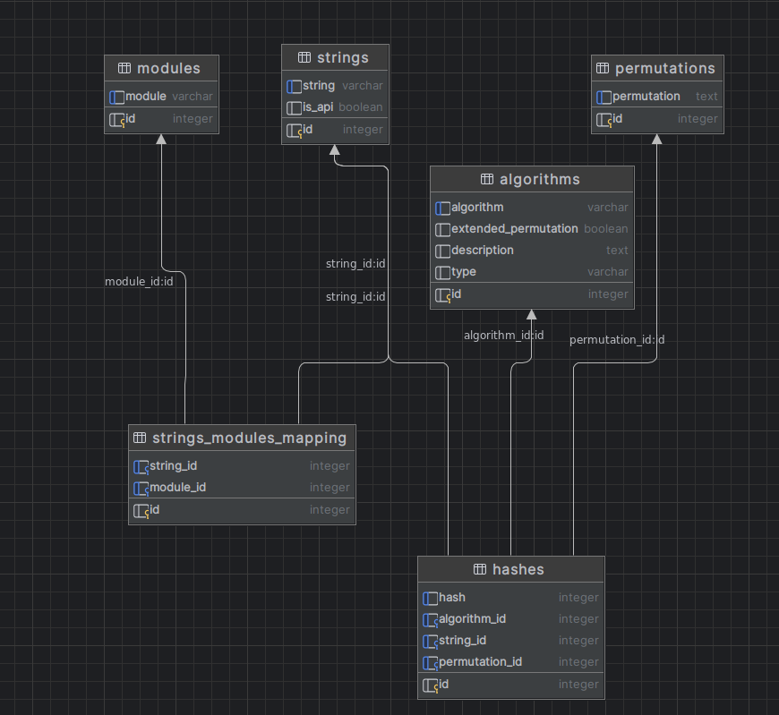

# HashDB Builder

Creates a database for [HashDB-IDA-Plugin](../hashdb.py) and our [HashDB Hook](../hashdb_hook/) in IDA.

## Requirements

- [functions_with_forwards.sqlite3](functions_with_forwards.sqlite3) (contains all relevant Windows APIs and module names)
- [requirements.txt](requirements.txt) (needed packages for some algorithms)
- [strings.txt](strings.txt)

## Algorithms

This database generates hashes with each algorithm in the algorithm folder.
If you want to add a new algorithm you have to follow three steps:

1. Use the template below or the file in the template folder and fill the template with the needed information
2. (Re)name you algorithm file
3. Run hashdb_builder.py to create the database to fill it with the new hashes from your algorithm

### Algorithm template
```
#!/usr/bin/env python

DESCRIPTION = "ADD YOUR DESCRIPTION HERE"
EXTENDED_PERMUTATION = True # set on true only if extended permutations is needed
TYPE = 'unsigned_int'  # change it if needed
# Test must match the exact has of the string 'ABCDEFGHIJKLMNOPQRSTUVWXYZabcdefghijklmnopqrstuvwxyz0123456789'
TEST_1 = 4012183583  # generated hash with your code and the test string from above


def hash(data):
    #  INSER_HERE_YOUR_CODE
    pass

```

## Strings

There are two kinds of strings:
- APIs: API names that also have a module associated to them
- Strings: Module names and strings from the strings.txt file

## Database



### Adding new DLLs

If you would like to add new DLLs to `functions_with_forwards.sqlite3` so that they are available in HashDB, follow these steps:

1. Create a new folder that *only* contains the DLLs you would like to add
2. Run `python ./make_function_db.py <new_dll_folder> ./functions_with_forwards.sqlite3` (requires a venv with pefile)
3. Rebuild the lookup database: `python ./hashdb_builder.py`

### How `hashdb_builder.py` works

1. Create new database with tables
2. Insert algorithms into db from algorithms/
3. Insert permutations into db
4. Import dll values from the old db into the new modules table
5. Import function values from the old db into the new strings table
6. Import the dependencies between functions and dlls into strings_modules_mapping
7. Import dll values new strings table
8. Import strings from strings.txt into strings table
9. Generate with all algorithms and permutations all hashes for the strings table

## Standalone module usage
HashDB can be used in your reverse engineering scripts like any standard Python module. For example listing all algorithms in the database and hash a test string is shown below.

```
>>> import hashdb_builder
>>> hashdb_builder.list_algorithms()
[..., 'crc32', ...]
>>> hashdb_builder.algorithms.crc32.hash(b'test')
3632233996
```

## Running tests
To test your code for new algorithms you can run the provided test framework by running the following commands:

```python
pip install pytest
python -m pytest
```